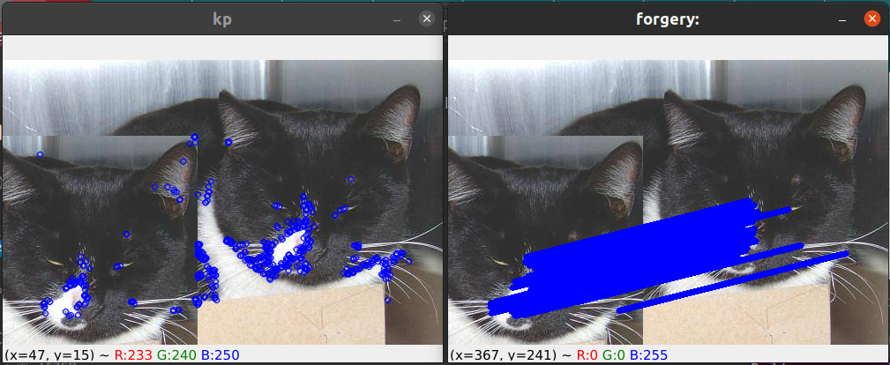
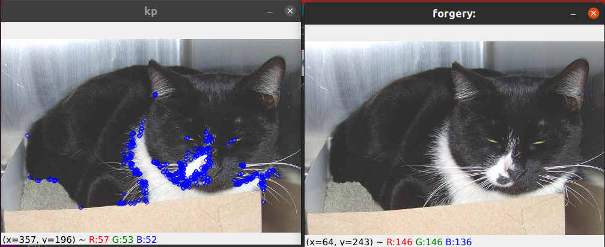

# DBSCAN_tamper
Detecting image tamper using DBSCAN clustering of orb features

[](https://github.com/jerinka/DBSCAN_tamper/actions/workflows/main.yml)


# Run
```python3 dbscan.py```

## Tampered case


## Original case
